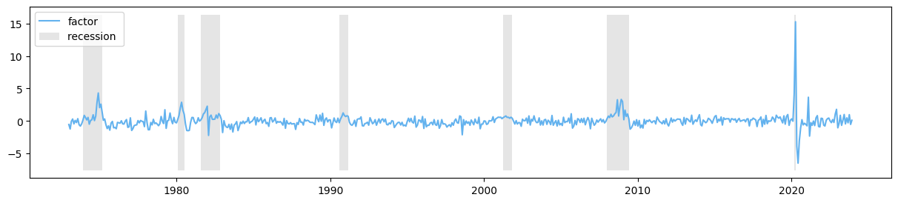
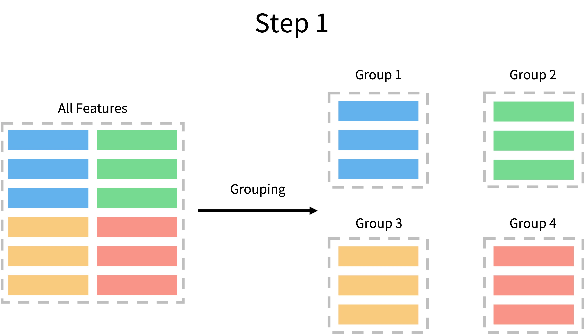

# Recession Identification and Prediction

> Winter is coming, because the Indians are collecting firewood like crazy.

Team Members: Zichao Xiong, Yutao Yuan

## 1. Introduction

### 1.1 Background

People want the macro-economy to get better every day. We don't want recessions or depressions, but bad things are often known only after they happen. Thus, an effective early warning method is waiting to be discovered. We hope to anticipate economic crises in advance, which will give us time to adopt governmental or fiscal policies (whether or not they actually work).

To accomplish this prediction, scientists usually assume that what has happened in the past will happen again in the future. Thus, historical data will provide us with enough information to make predictions. We will follow this idea by combining economic data and machine learning methods to identify or predict the onset of a recession.

### 1.2 Read Data from FRED

[Federal Reserve Economic Data](https://fred.stlouisfed.org/) (Fred) offers a lot of economic data which can be easily read by python. We picked six independent variables (X) and one dependent binary variable (y). 

```python
start = '1950-01-01'
end = '2023-12-01'

production = DataReader('IPMAN', 'fred', start=start, end=end)
income = DataReader('W875RX1', 'fred', start=start, end=end)
sales = DataReader('CMRMTSPL', 'fred', start=start, end=end)
employees = DataReader('PAYEMS', 'fred', start=start, end=end)
interest_rate = DataReader('FEDFUNDS', 'fred', start=start, end=end)
cpi = DataReader('CORESTICKM159SFRBATL', 'fred', start=start, end=end)
recession = DataReader('USREC', 'fred', start=start, end=end)
```

After converting the series into dataframe, the dataset will look like the following (of course it starts at 1950, but we show 2001 to avoid too many NaNs):


| DATE | production | income | sales | employees | interest_rate | cpi | recession |
|------------:|------------:|---------:|-----------:|-----------:|---------------:|----------:|-----------:|
| 2001-01-01 | 92.25 | 10400.3 | 1061578.0 | 132699 | 5.98 | 2.88 | 0 |
| 2001-02-01 | 91.75 | 10421.6 | 1066262.0 | 132786 | 5.49 | 2.98 | 0 |
| 2001-03-01 | 91.55 | 10452.6 | 1053481.0 | 132751 | 5.31 | 2.96 | 0 |
| 2001-04-01 | 91.16 | 10410.4 | 1045172.0 | 132455 | 4.80 | 3.09 | 1 |
| 2001-05-01 | 90.59 | 10376.7 | 1054208.0 | 132411 | 4.21 | 3.07 | 1 |

The six dependent variables can be plotted as follows, while the gray regions denote recession period (when recession == 1):


Next we differentiate the variables in the log form so that it reflects some kind of difference over time.

$$\mathrm{d}\ln x_{i, t, p} = \ln x_{i, t} - \ln x_{i, t-p}$$

Here $i$ indicates production, income, sales and so on. $t$ is the current time and $p$ is the lag that takes the value of 1, 3, 6 or 12.

### 1.3 Split Training set and Test Set

```python
train_start = df.index[0]
train_end = '2005-12-01'

test_start = '2006-01-01'
test_end = '2023-12-01'
```

## 2. Identification

Identification means that, we are only to use the current X to classify the current y. It might not be useful in real world but can help us set up a simple model first.

### 2.1 Hidden Markov Chain

The most famous way to analyze recessions is hidden markov chain and factor method. In general, it is assumed that both economic output and recession are determined by a hidden factor. Once we discover the factor through certain model, we can predict recessions using this factor.


In this case, we define the model as follows

$$\begin{align}
x_{i,t} & = \lambda_i f_t + u_{i,t} \\
u_{i,t} & = c_{i,1} u_{1,t-1} + c_{i,2} u_{i,t-2} + \varepsilon_{i,t} \qquad & \varepsilon_{i,t} \sim N(0, \sigma_i^2) \\
f_t & = a_1 f_{t-1} + a_2 f_{t-2} + \eta_t \qquad & \eta_t \sim N(0, I)\\
y_{t} & = \text{Logistic}(f_t) \\
\end{align}$$

Here $x_{i, t}$ are `[production, income, sales, employees, interest_rate, cpi]`. $f_{i, t}$ is the hidden factor and $u_{i, t}$ is the error term. We assume that $f_{i, t}$ and $u_{i, t}$ follows AR(2) process. And recession indicator $y_{i, t}$ is a function of factor $f_{i, t}$.



The identification accuracy of factor model is 0.8913.

### 2.2 Machine Learning Method

We apply what we have learned in this course to identify recessions:

1. Use all features;
2. Extract features by PCA;
3. Use L1-norm logistic regression to select features;

But all these methods have certain drawbacks, they cannot give a very robust results in different situations (high variance).

Luckily, we read a paper about **Semi-auto Method** (Moro et al., 2014) which can solve the problems. It is called semi-automatic because this method requires first grouping features using intuition, and then for each group various machine learning methods can be applied to select features. The process is given as follows:




```python
clf1 = LogisticRegression(penalty='l2', 
                          C=0.1,
                          solver='lbfgs',
                          random_state=1)

clf2 = SVC(kernel='rbf', 
           gamma=0.1,
           C=10,
           random_state=1,
           probability=True)

clf3 = RandomForestClassifier(n_estimators=100,
                              criterion='entropy',
                              max_depth=6,
                              bootstrap=True,
                              random_state=1)

classifiers = [clf1, clf2, clf3]

sel = feature_selection.SemiautoFeatureSelection(T1 = 0.6, T2 = 0.65, T3 = 0.01, T4 = 0.7, classifiers = classifiers)
sel.comp_score(X_train, y_train, X_test, y_test, grouped_X_columns)
label = sel.first_select(grouped_X_columns)
group_SemiautoFeatureSelection = sel.second_select(X_train, y_train, label)
```

### 2.3 Comparison

| feature_type | unselected | unselected | l1_lr    | l1_lr    | semiauto | semiauto |
| ------------ | ---------- | ---------- | -------- | -------- | -------- | -------- |
| score        | accuracy   | roc_auc    | accuracy | roc_auc  | accuracy | roc_auc  |
| lr           | 0.916667   | 0.982908   | 0.958333 | 0.988265 | 0.967593 | 0.990051 |
| svm          | 0.953704   | 0.973980   | 0.949074 | 0.984184 | 0.953704 | 0.979719 |
| rf           | 0.953704   | 0.965051   | 0.953704 | 0.972959 | 0.962963 | 0.956378 |


We find the following characteristics:

* All machine learning method can do better than 90% accuracy and ROC AUC, indicating that identification is easy for machine learning.
* All machine learning performs better than hidden markov chain.
* We do not observe obvious difference between different feature selection methods or ML methods.

In the next chapter, we will move on to the prediction problem.

## 3.Prediction

### 3.1 Why Prediction?

Note that in the previous chapter, we accomplish just the identification, i.e., using the independent variable for a given month to compute the dependent variable for the same month. This may yield good results, but it is not very practical, due to two reasons:

1. When we get this month's economic data, it is also determined that a recession is happening or not;

2. To make matters worse, some economic data is less current, which means that we can't access the current month's data until about two months later, and then the act of identification becomes just a historiographical study.

So we are more curious about whether machine learning algorithms can predict recessions. 

### 3.2 Dependent Variable Definition

We will define the following variable: `'recession_in_6m'`. This variable represents whether, for any month $t$, a recession occurred from month $t$ to $t+5$. If so, then `'recession_in_6m'` will take the value of 1 and otherwise 0.

```python
df_pred = df.copy()
foo = df_pred.sort_index(ascending=False)
foo.loc[:, 'recession_in_6m'] = foo.loc[:, 'recession'].rolling(6, min_periods=1).max().astype('int')
df_pred = foo.sort_index(ascending=True)
df_pred.drop(columns='recession', inplace=True)
df_pred.dropna(inplace=True)
```

### 3.3 Machine Learning Method

As we have done before, we will predict recessions by 4 steps:

1. Use all features;
2. Extract features by PCA;
3. Use L1-LR to select features;
4. Use semi-auto method to select feature.

Notes that because hmm performs the worst in previous identification problems, we are not to use it as a way to predict recessions any more.

### 3.4 Comparison


Now we find the advantage of the semi-auto method:

* It minimizes variance as well as maximizes scores among all these feature selection methods.
* It is less volatile between different machine learning models.

The reason might be that:

* In semi-auto feature selection, we take the similarity within group and difference between groups into account.
* We select different classifier when selecting features in different machine learning models.

## 4. Convolutional Neural Network

Remember the image we draw in Chapter 1? As humans, when we see unusual fluctuations in the economy, we predict that a recession is going to happen. Such judgments are made intuitively, without the help of any numbers or calculations. We wonder if machine learning, or more specifically, neural networks, have the same ability, where we feed in images of plotted economic data, and it can look at the images and output a judgment about the recession.

### 4.1 Generate Picture

To examine this, we first draw the economic figures. Here we use only the raw data and do not use any differentiated results. Similarly, we do not include the axis ticks in plotting.

```python
my_dpi = 192
length = df_cnn.shape[0]

for n in range(12, length - 6):
    m = n - 12
    fig, axes = plt.subplots(nrows=3, ncols=2, figsize=(800/my_dpi, 800/my_dpi), dpi=my_dpi)
    for k, column in enumerate(X_columns_raw):
        i, j = k//2, k%2
        axes[i, j].plot(df_cnn.index[m:n], df_cnn.iloc[m:n][column], c = 'k')
        axes[i, j].set_facecolor("white")
        axes[i, j].set_xticks([])
        axes[i, j].set_yticks([])
        axes[i, j].spines['top'].set_visible(False)
        axes[i, j].spines['right'].set_visible(False)
        axes[i, j].spines['bottom'].set_visible(False)
        axes[i, j].spines['left'].set_visible(False)

    figure_name = df_cnn.index[n].strftime('%Y%m%d') + '-' + str(int(df_cnn.iloc[n]['recession_in_6m']))
    figure_path = 'figures/' + figure_name + '.png'
    plt.savefig(figure_path)
    plt.close()
```


### 4.2 Split Training Validation and Test Set

The dataset is split as follows:

* 0-399: Training set;
* 400-499: Validation set;
* 500-593: Test set.

```python
ds_train = ds_images_labels.shuffle(buffer_size=100,
                                  reshuffle_each_iteration=False)

mnist_train_all = ds_train.take(500)
mnist_valid = mnist_train_all.skip(400).batch(40)
mnist_train = mnist_train_all.take(100).batch(40)
mnist_test = ds_train.skip(500)
```

### 4.3 Set Neural Network

The neural net work is set up as follows:


### 4.4 Train NN

We run 10 epochs and get a validation accuracy of 0.91. In the test set the accuracy is about 0.86.

## 5. Conclusion

In this project, we use a variety of methods to identify and predict recessions.

* In identification part:
  * The traditional Hidden Markov Chain Factor Model approach shows an accuracy less than 90%.
  * The machine learning approach can achieve an accuracy and ROC AUC of over 90%.
  * Different machine learning methods do not seem different from each other.
* In prediction part:
  * By using a similar approach, we can predict recession in six months with an accuracy of around 85%.
  * In particular, semi-auto feature selection performs best in different scenarios.
  * If we believe that economic patterns can be read from graphs, NN gives us an accuracy of 86%.

Such a project could be further developed in the future. Hyper-parameters can be chosen more carefully (i.e., using 18 months data to predict recession in 3 months) to get better scores. Also it might be possible to build more complex neural network models that can recognize recession patterns by inputting single variable economics plots.

## References

1. Moro, S., Cortez, P., & Rita, P. (2014). A data-driven approach to predict the success of bank telemarketing. *Decision Support Systems*, *62*, 22-31.

## Appendix: Joke about Weather

We include this joke because we think doing regressions on economic data is very similar with this joke.

> Fall was upon a remote reservation when the Indian tribe asked their new Chief what the coming winter was going to be like. The modern day Chief had never been taught the secrets of the ancients. When he looked at the sky he couldn't tell what the winter was going to be like.
>
> Better safe than sorry, he said to himself and told his tribe that the winter was indeed expected to be cold and that the members of the village should stock up on firewood to be prepared.
>
> After several days, our modern Chief got an idea. He went to the phone booth, called the National Weather Service and asked, "Is the coming winter going to be cold?"
>
> "It looks like this winter is going to be quite cold," the meteorologist at the weather service responded.
>
> So the Chief went back to his people and told them to collect even more firewood in order to be prepared. A week later he called the National Weather Service again. "Does it still look like it is going to be a very cold winter?"
>
> "Yes," the man at National Weather Service again replied, "It's going to be a very cold winter."
>
> The Chief again went back to his people and ordered them to collect every scrap of firewood they could find. Two weeks later the Chief called the National Weather Service again. "Are you absolutely sure that the winter is going to be very cold?"
>
> "Absolutely," the man replied. "It's looking more and more like it is going to be one of the coldest winters ever."
>
> "How can you be so sure?" the Chief asked.
>
> The weatherman replied, "The Indians are collecting firewood like crazy."
>
>  
>
> 印第安人来问他们的酋长，“今年冬天冷不冷？”酋长也吃不准，但也不好直说不知道，就说：“肯定很冷，大家要多准备过冬用的劈柴。”于是大家就都去准备劈柴。 
>
> 酋长是个认真负责的人。一个星期之后，他跑到电话亭里打电话给国家气象服务中心，问：“今年冬天冷不冷？”气象中心的人说：“冷得很。”
>
> 酋长这才放心，回来后又通知了他的子民一遍：“要多准备柴火过冬。”又过了一星期，酋长有点不放心，又给气象中心打电话，被告知：“非常非常冷。”
>
> 酋长再次通知子民加大准备柴火的力度。两个星期后，酋长又打电话，被告知：“非常非常非常冷。”酋长急忙通知子民要把收集柴火当头等大事来抓，尽一切努力收集柴火。
>
> 两个星期以后，酋长再次打电话，气象中心的人用极其肯定的语气说：“可以肯定地说，今年的冬天将是有史以来最冷的冬天，因为我们看见印第安人正疯狂地收集柴火。“

